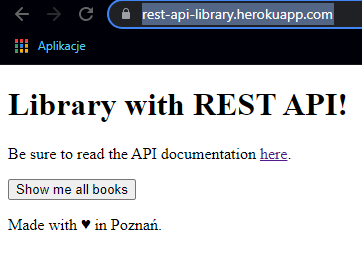
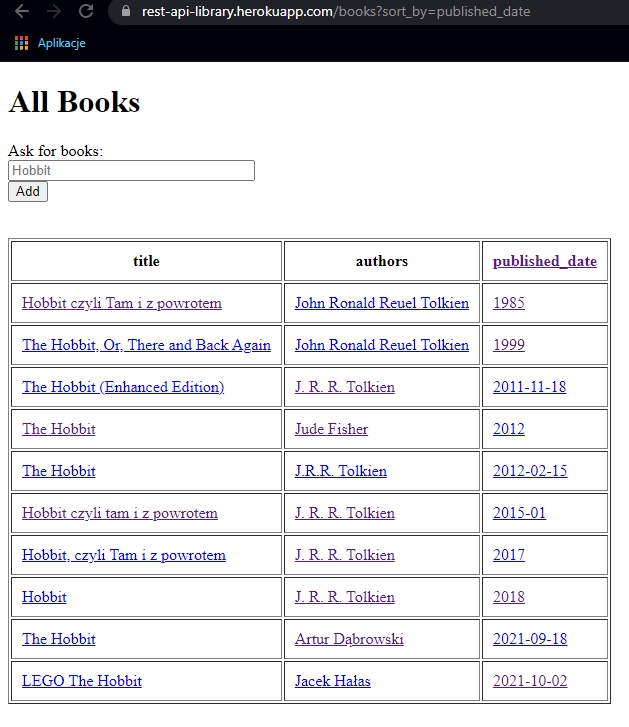
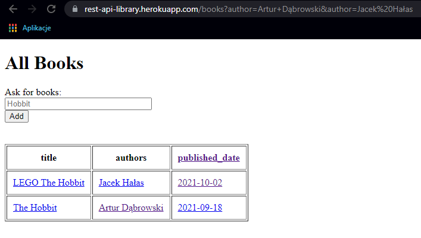
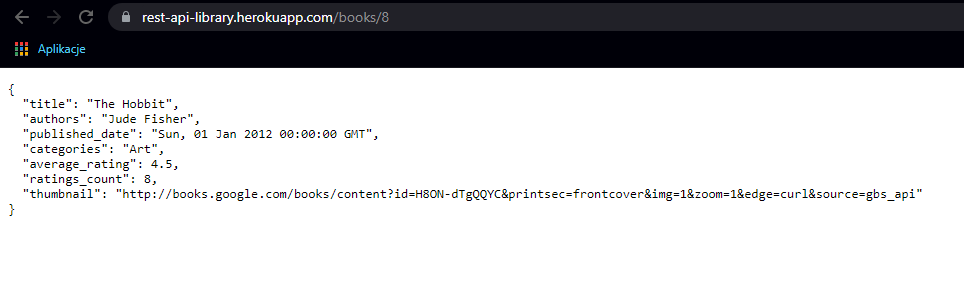
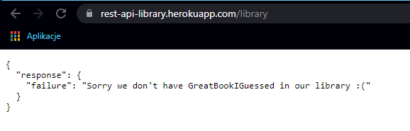
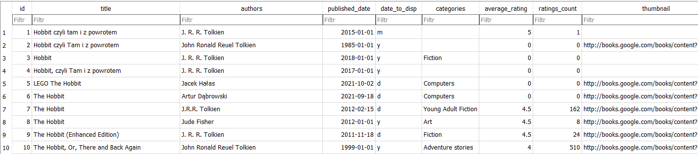

# FLASK_library
Web-Based library with REST API.

## Table of contents
* [General info](#general-info)
* [Screenshots](#screenshots)
* [Technologies](#technologies)
* [Setup](#setup)
* [Status](#status)

## General info
It is one of the Flask projects which is suppoused to hone my skills in web development.

Main goals of the project were:
* Use REST API.
* Create GET method to show all books.
* Create GET method to filter and sort books by date.
* Create GET method to filer books by authors.
* Create GET method to show book details.
* Create POST function which will add new books to library and replace existing ones.
* Use Google Boooks API to maintain library.

I have made the following assumptions:
* Book details are displayed in JSON format.
* Feedback to user about incorrect application behaviour is also displayed in JSON.
* Given data was in JSON format, to ensure correct sorting, I saved the dates in DATE format and passed them to the user in this format as a JSON component.
* Authors and categories were stored as lists, I pass them to the user as a string separated with ",".
* As there is no delete method, I did not convert the database to postgresql, I kept the SQLite which Heroku restores to initial state every given period of time.

As an IDE I used Pycharm from JetBrains.

Tools used:
* As Web App Framework I used _Flask_ - It gives great flexibility to work and I have the most experience with this tool.
* To communicate with DB I used _SQLAlchemy_, its SQL toolkit and ORM works quite well with Flask.
* Whole UI is based only on HTML.
* App is deployed on Heroku and it's available [here](https://rest-api-library.herokuapp.com/).

## Screenshots

## Technologies
All techngologies used for this project are included in requirements.txt file.

## Setup
You can use the IDE or Terminal to build this project. Below I present the instructions on how to run the program.

1. Clone the repository.
2. Unzip project.
3. Go to the folder where you unpacked this project.
4. Run: pip install -r requirements.txt in your shell.
5. Run: main.py
6. Go to Your local host link. (For me it's 127.0.0.1 with port 5000).
7. Play around.

## Ideas for further development
* Add multi-user functionality.
* Hash and salt password of further users.

## Status
Project is: _finished_.
